## dsPIC33CK Curiosity Development Board - CAN-FD Demo

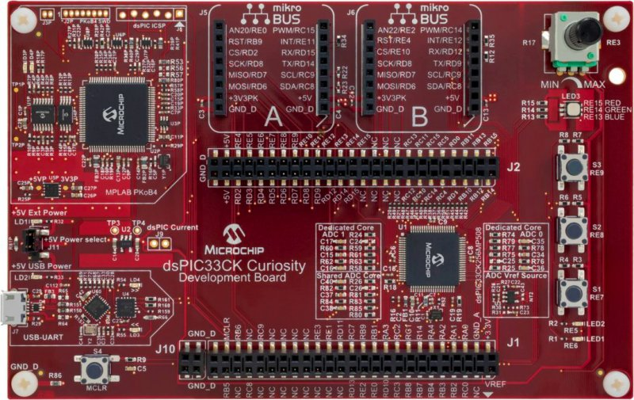

## Summary

This project demonstrates the CAN FD communication on dsPIC33CK Curiosity board using MCC- Melody driver code.

Demo code will loopback the CAN FD data messages if received message ID is 100 (0x64) or 101 (0x65), it responds with IDs to 120 (0x78) and 121 (0x79) respectively. Green LED will blink if data is received and transmitted back successfully.

CAN FD is configured in such a way that it ignores any messages other than above mentioned IDs on the bus.

## Related Documentation

[dsPIC33CK256MP508 datasheet](https://www.microchip.com/dsPIC33CK256MP508) for more information or specifications.

## Software Used

- [MPLAB® X IDE v6.00](http://www.microchip.com/mplab/mplab-x-ide) or newer
- [MPLAB® XC16 v2.00](http://www.microchip.com/mplab/compilers) or newer
- Packs : dsPIC33CK-MP_DFP v1.7.208
- [MPLAB® Code Configurator (MCC) 5.1.0](https://www.microchip.com/mplab/mplab-code-configurator) or newer
- [MPLAB® Data Visualizer v1.3.1136](https://www.microchip.com/en-us/tools-resources/debug/mplab-data-visualizer) or any other serial terminal
- [OptoLyzer® Studio Lite v1.8.1.1](https://www.microchip.com/en-us/tools-resources/develop/k2l-automotive-tools/optolyzer-studio) or any CAN-FD analyzer tool

## Hardware Used

- [dsPIC33CK Curiosity Board](https://www.microchip.com/en-us/development-tool/DM330030#)

- [MCP2542 Click Board](https://www.mikroe.com/mcp2542-click)

- CAN FD Analyzer with DB9 Serial port

## Setup

**Hardware Setup**

- Plug the [MCP2542 Click Board](https://www.mikroe.com/mcp2542-click) to **microBUS B** of Curiosity board
- Connect CAN-FD analyzer to [MCP2542 Click Board](https://www.mikroe.com/mcp2542-click) via DB9 serial connector
- Connect micro-USB cable provided along with curiosity board to PC for viewing debug messages.
- [Click here](images/hardware_setup.jpg) to view the hardware setup.

**MPLAB® X Setup**

- Open the `dspic33ck-curiosity-canfd.X` project in MPLAB® X
- Build and program the device

**CAN FD Analyzer Tool Setup**

- Configure CAN-FD analyzer clock to 1 Mbps nominal bit-rate and 5 Mbps data bit-rate
- Start the analyzer log and create CAN-FD data frames with message ID 101(0x64), 102(0x65) and 103(0x66)

## Operation

- Sending CAN FD standard or extended data frame with message ID 100 (0x64) or 101 (0x65) on the CAN bus, the demo code will transmit back the same data with message ID to 120 (0x78) and 121 (0x79) respectively on the bus (Loopback). Green LED will blink acknowledging that data message is received and transmitted back successfully. If LED is Red, then CAN node has entered error Active/Warning/Passive state. If LED is Yellow, then transmit or receive is in progress while the CAN node is in error Active/Warning/Passive state.
- Sending any message with ID other than 100 or 101, the can peripheral will ignore the message and no response is observed.
- Received and transmitted frames from CAN FD peripheral can also be viewed from the serial terminal for debug purposes

Following is a snip of the CAN analyzer log when messages with ID 0x64, 0x65 and 0x66 are sent from the analyzer one after the other 

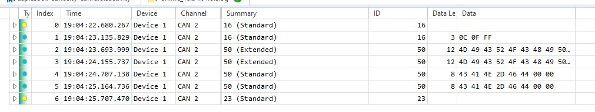

**Summary of the above log:**

| Message Index in the log | Description                                                                                                                                   | Transmitter         | Type              | Message ID in HEX | Data Length in decimal | Data in HEX                                                                                                                                                                                     |
| ------------------------ | --------------------------------------------------------------------------------------------------------------------------------------------- | ------------------- | ----------------- | ----------------- | ---------------------- | ----------------------------------------------------------------------------------------------------------------------------------------------------------------------------------------------- |
| 0                        | Standard data frame sent from the analyzer with message ID 100 (0x64)                                                                         | CAN -FD Analyzer    | CAN FD Data Frame | 0x64 (Standard)   | 12                     | 4D 49 43 52 4F 43 48 49 50 00 00 00                                                                                                                                                             |
| 1                        | Loopback of the data frame with message ID 120 (0x78)                                                                                         | dsPIC33CK Curiosity | CAN FD Data Frame | 0x78 (Standard)   | 12                     | 4D 49 43 52 4F 43 48 49 50 00 00 00                                                                                                                                                             |
| 2                        | Extended data frame sent from the analyzer with message ID 101 (0x65)                                                                         | CAN -FD Analyzer    | CAN FD Data Frame | 0x65 (Extended)   | 64                     | 41 42 43 44 45 46 47 48 49 4A 4B 4C 4D 4E 4F 50 51 52 53 54 55 56 57 58 59 5A 20 61 62 63 64 65 66 67 68 69 6A 6B 6C 6D 6E 6F 70 71 72 73 74 75 76 77 78 79 7A 20 31 32 33 34 35 36 37 38 39 30 |
| 3                        | Loopback of the data frame with message ID 121 (0x79)                                                                                         | dsPIC33CK Curiosity | CAN FD Data Frame | 0x79 (Extended)   | 64                     | 41 42 43 44 45 46 47 48 49 4A 4B 4C 4D 4E 4F 50 51 52 53 54 55 56 57 58 59 5A 20 61 62 63 64 65 66 67 68 69 6A 6B 6C 6D 6E 6F 70 71 72 73 74 75 76 77 78 79 7A 20 31 32 33 34 35 36 37 38 39 30 |
| 4                        | Extended data frame sent from the analyzer with message ID 103. This message will be ignored from the curiosity board as per filter settings. | CAN -FD Analyzer    | CAN FD Data Frame | 103 (Extended)    | 12                     | 4D 49 43 52 4F 43 48 49 50 00 00 00                                                                                                                                                             |

## MCC Settings

This application uses **MCC-Melody** framework provided through MCC plugin.The following steps illustrate the settings from MCC-Melody.

**CAN FD Configuration**

- Under `Device Resources` load `CAN FD` driver which auto-loads `CAN1 PLIB` dependency
- Set custom name to `canFdDrv`  
  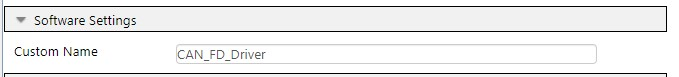
- Clock and Nominal Bit-Rate Settings: Set CAN clock to 20 MHz, nominal bit rate to 1Mbps and sample point to 80% 
  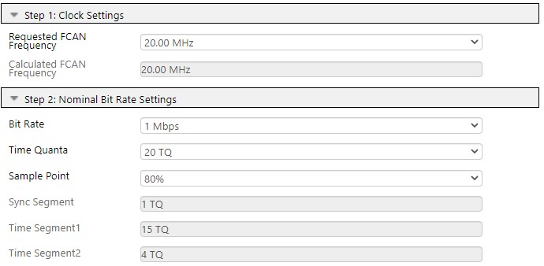
- Data Bit-Rate Settings: Enable data bit rate, set bit rate to 5Mbps, sample point to 75%. Enable ISO CRC and enable error interrupt  
  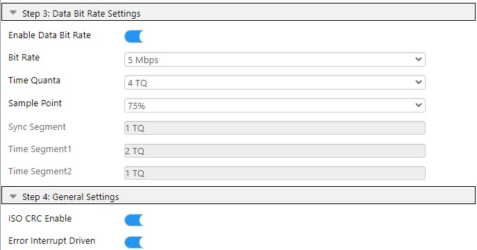
- FIFO Configuration: Enable TXQ, set depth as 32, payload bytes as 64. Enable FIFO1, set depth as 32, payload bytes as 64 and operation to RX 
  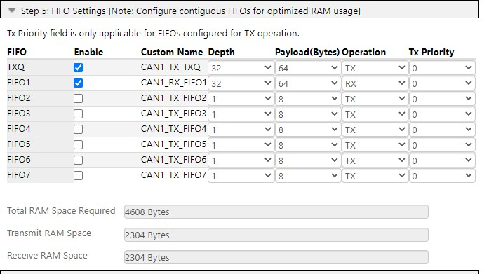
- Receive Filter Configuration: Enable Filter0 and type message IDs `0x64, 0x65, 0x64x,0x65x`. This will filter all messages allowing only standard and extended messages with ID 0x64 and 0x65 
  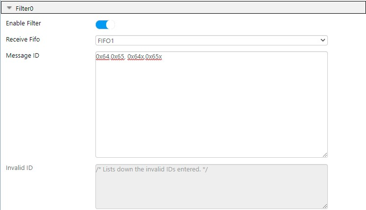

**UART Configuration**

- Load UART driver and select `UART1` as dependency
- Make following configurations in UART driver  
  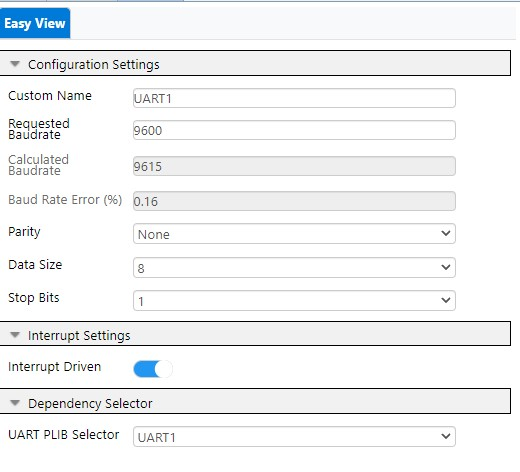

**PIN Configuration**

- Go to `Pin Grid View`
- CAN FD pins: Select RD9 for CAN1TX and RD12 for CAN1RX
- UART Pins: Select RD4 as U1TX and RD3 as U1RX 
  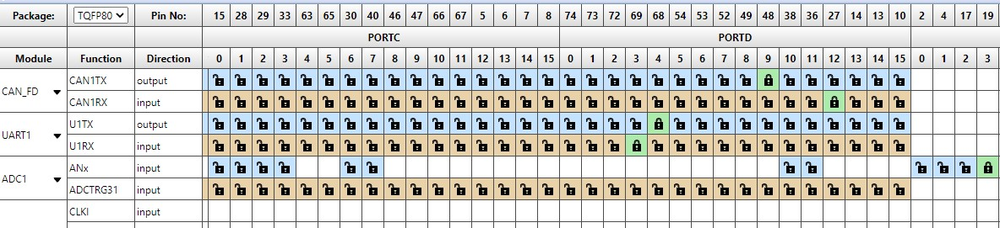
- LED Pins: Select RE14 and RE15 as GPIO Output 
  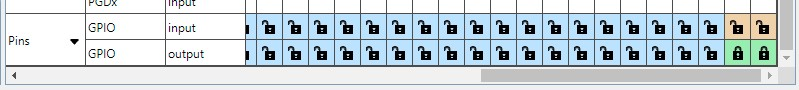
- Go to pins table view and change custom name of RE14 to `LED_GREEN` and RE15 to `LED_RED` 
  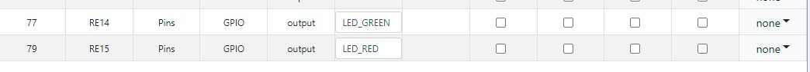

## OptoLyzer Studio Activity File

If the CAN-FD analyzer uses `OptoLyzer® Studio`, then a pre-configured activity file can be found [here](optolyzerActivityFile/)
