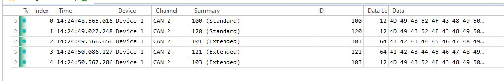

## dsPIC33CK Curiosity Development Board - CAN-FD Demo

## Summary

This project demonstrates the CAN-FD setup, driver implementation on dsPIC33CK Curiosity board and analyzing the messages over the CAN bus using any CAN-FD analyzer.

Curiosity board will loopback the data messages received from the analyzer.

If the CAN frame is RTR (Remote Transmit Request), message ID is checked. If it is `16` then ADC conversion is triggered which measures the on-board potentiometer value and transmits the ADC conversion result back to the CAN bus. For RTR frame with message ID other than `16`, there will not be any response from curiosity board. This is purely application behavior of this demo.

## Related Documentation

https://www.microchip.com/dsPIC33CK256MP508

## Software Used

- [MPLAB X v6.00](https://www.microchip.com/en-us/tools-resources/develop/mplab-x-ide) or higher with [MCC Plugin](https://www.microchip.com/en-us/tools-resources/configure/mplab-code-configurator) installed
- [MPLAB Data Visualizer Plugin](https://www.microchip.com/en-us/tools-resources/debug/mplab-data-visualizer) or any other serial terminal
- [OptoLyzer Studio](https://www.microchip.com/en-us/tools-resources/develop/k2l-automotive-tools/optolyzer-studio) or any CAN-FD analyzer tool

## Hardware Used

- [dsPIC33CK Curiosity Board](https://www.microchip.com/en-us/development-tool/DM330030#)

- [MCP2542 Click Board](https://www.mikroe.com/mcp2542-click)

- Any CAN FD Analyzer with DB9 Serial port

- DB9 Serial CAN bus with 120 Ohm terminal resistor:
  [Click to view](images/terminal_resistor.jpg)

## Setup

- Plug the [MCP2542 Click Board](https://www.mikroe.com/mcp2542-click) to microBUS B of Curiosity board
- Connect CAN-FD analyzer to [MCP2542 Click Board](https://www.mikroe.com/mcp2542-click) via DB9 Serial connector with 120 Ohm terminal resistor
- Connect micro-USB cable provided along with curiosity board to PC for viewing debug messages.
- [Click here](images/hardware_setup.jpg) to view the hardware setup.

## Operation

- Open the `dspic33ck-curiosity-canfd.X` project in MPLAB X
- Build and program the device
- Configure CAN-FD analyzer clock to 1 Mbps nominal bit-rate and 5 Mbps data bit-rate
- Start the analyzer log and send any kind of CAN-FD frames

**Following are the application behavior for various CAN-FD frames sent from the analyzer**

- **Case A** : Sending RTR frame with message ID 16 from analyzer will fetch ADC Converted POT value of CK Curiosity board wherein the first byte will specify resolution and next 2 bytes are ADC converted value. (In below example CK Curiosity responds 0C 0F FF which says that resolution is 12-bit and ADC converted value is 0x0FFF)
- **Case B** : Sending CAN FD extended data frame on the CAN bus, the CK Curiosity will transmit back the same frame on the bus (Loopback)
- **Case C** : Sending CAN FD standard data frame on the CAN bus, the CK Curiosity will transmit back the same frame on the bus (Loopback)
- **Case D** : Sending RTR frame other than message ID 16 from analyzer, the CK Curiosity will not respond as per this application

Following is a snip of the log when the above mentioned cases are run one after the other 

**Summary of the above log:**

| Case | Message Index in the log | Description                                                                                              | Transmitter      | Type              | Message ID in decimal | Data Length in decimal | Data in HEX                         |
| ---- | ------------------------ | -------------------------------------------------------------------------------------------------------- | ---------------- | ----------------- | --------------------- | ---------------------- | ----------------------------------- |
| A    | 0                        | Send RTR with message ID 16 to get ADC converted POT value of curiosity board                            | CAN -FD Analyzer | CAN Remote Frame  | 16 (Standard)         |                        |                                     |
|      | 1                        | Curiosity board responds with 24 bit value, in this case 0x0C - resolution, 0x0FFF- ADC converted value. | CK Curiosity     | CAN FD Data Frame | 16 (Standard)         | 3                      | 0C 0F FF                            |
|      |                          |                                                                                                          |                  |                   |                       |                        |                                     |
| B    | 2                        | Extended data frame sent from the analyzer                                                               | CAN -FD Analyzer | CAN FD Data Frame | 50 (Extended)         | 12                     | 4D 49 43 52 4F 43 48 49 50 00 00 00 |
|      | 3                        | Loopback of data frame                                                                                   | CK Curiosity     | CAN FD Data Frame | 50 (Extended)         | 12                     | 4D 49 43 52 4F 43 48 49 50 00 00 00 |
|      |                          |                                                                                                          |                  |                   |                       |                        |                                     |
| C    | 4                        | Standard data frame sent from the analyzer                                                               | CAN -FD Analyzer | CAN FD Data Frame | 50 (Standard)         | 8                      | 43 41 4E 2D 46 44 00 00             |
|      | 5                        | Loopback of data frame                                                                                   | CK Curiosity     | CAN FD Data Frame | 50 (Standard)         | 8                      | 43 41 4E 2D 46 44 00 00             |
|      |                          |                                                                                                          |                  |                   |                       |                        |                                     |
| D    | 6                        | RTR frame other than message ID 16                                                                       | CAN -FD Analyzer | CAN Remote Frame  | 23 (Standard)         |                        |                                     |
|      |                          | CK Curiosity will not respond to RTR messages other than 16 as per this application                      |                  |                   |                       |                        |                                     |

CAN-FD frames received by the curiosity board are printed in the serial terminal for debug purposes

## Creating the project using MCC - Melody

- Create a project in MPLAB X for the device dsPIC33CK256MP508
- Load MCC plugin and select `MCC Melody` from the content manager

**CAN Configuration**

- Under `Device Resources` load `CAN FD` driver which auto-loads `CAN1 PLIB` dependency
- Set custom name to `CAN FD`  
  
- Clock and Nominal Bit-Rate Settings: Set CAN clock to 20 MHz, nominal bit rate to 1Mbps and sample point to 80% 
  
- Data Bit-Rate Settings: Enable data bit rate, set bit rate to 5Mbps, sample point to 75%. Enable ISO CRC and enable error interrupt  
  
- FIFO Configuration: Enable TXQ, set depth as 32, payload bytes as 64. Enable FIFO1, set depth as 32, payload bytes as 64 and operation to RX 
  
- Receive Filter Configuration: `0x0, 0x7FF` will allow all the standard frames, `0x0x and 0x1FFFFFFF` will allow all the extended frames 
  

**UART Configuration**

- Load UART driver and select `UART1` as dependency
- Make following configurations in UART driver  
  

**ADC Configuration**

- Load ADC driver which auto-loads `ADC1 PLIB`
- Set requested shared core sampling time to 5us 
  
- Enable AN23, change custom name to `POT_Channel`, trigger source as `Common Software Trigger` and enable interrupt
  

**PIN Configuration**

- Go to `Pin Grid View`
- CAN FD pins: Select RD9 for CAN1TX and RD12 for CAN1RX
- UART Pins: Select RD4 as U1TX and RD3 as U1RX
  

**Application**

- Generate the code
- Copy and replace the entire main.c file contents from [here](dspic33ck-curiosity-canfd.X/main.c)

## OptoLyzer Studio Activity File

If the CAN-FD analyzer uses `OptoLyzer Studio`, then a pre-configured activity file can be found [here](optolyzerActivityFile/)
